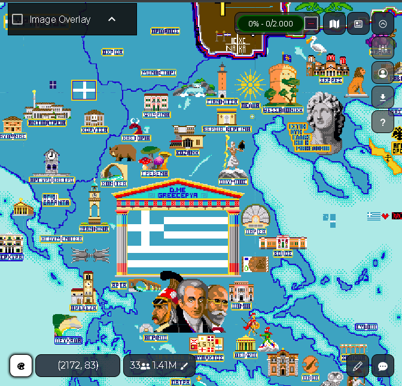

# PixelPlanet.fun


[](https://pixelplanet.fun/guilded)

Official  repository of [pixelplanet.fun](http://www.pixelplanet.fun).


> **TRANSLATORS NEEDED** If you want to help us translate pixelplanet.fun, look into [i18n](./i18n)

Just to the 2nd anniversary of r/space, pixelplanet takes pixelgames to a new level. Place pixels, create pixelart and fight faction wars on pixelplanet.fun.
Pixelplanet is a 65k x 65k large canvas that is a map of the world and can also be seen as 3d globe, you can place pixels where ever you want, build an island, take over another country with a flag or just create pixelart.
30 well chosen colors (decided by polls within the community) are available and you can place a pixel every 3s on an empty space, and 5s on an already set pixel. But pixels can be stacked up to a minute, so you don't have to wait every time.

Pixelplanet receives regular updates and launches events, like a zero second cooldown day on r/place anniversary. We are driven by our community, because placing pixels is more fun together.

Controls:
W, A, S, D, click and drag or pan: Move
Q, E or scroll or pinch: Zoom
Click or tab: Place Pixel



## Build
### Requirements
- [nodejs environment](https://nodejs.org/en/)
- Linux or WSL if you want to be safe (we do not build on Windows and therefor can't guarantee that it will work there)

### Building
Checkout repository

```
git clone https://git.pixelplanet.fun/ppfun/pixelplanet.git
cd pixelplanet
```

Install packages and build

```
npm install
npm run build
```


All needed files to run it got created in `./dist`

Notes:

- If you run into problems, make sure that you have rights to g++ (if not, run as root and then chown username:username -R . after build)

- If `npm install` fails with "unable to connect to github.com" set:

```
git config --global url.https://github.com/.insteadOf git://github.com/
```

## Run
### Requirements
- nodejs environment with [npm](https://www.npmjs.com/get-npm)
- [pm2](https://github.com/Unitech/pm2) (`npm install -g pm2`) as process manager and for logging
- [redis](https://redis.io/) as database for storìng the canvas
- mysql or mariadb ([setup own user](https://www.digitalocean.com/community/tutorials/how-to-create-a-new-user-and-grant-permissions-in-mysql) and [create database](https://www.w3schools.com/SQl/sql_create_db.asp) for pixelplanet) for storing additional data like IP blacklist

### Configuration
Configuration takes place in the environment variables that are defined in ecosystem.yml

#### Neccessary Configuration

| Variable       | Description              |  Example                |
|----------------|:-------------------------|------------------------:|
| PORT           | Own Port                 | 8080                    |
| HOST           | Own Host                 | "localhost"             |
| REDIS_URL      | URL:PORT of redis server | "redis://localhost:6379"|
| MYSQL_HOST     | MySql Host               | "localhost"             |
| MYSQL_USER     | MySql User               | "user"                  |
| MYSQL_PW       | MySql Password           | "password"              |
| MYSQL_DATABASE | MySql Database           | "pixelpladb"            |

#### Optional Configuration

| Variable          | Description                           | Example                 |
|-------------------|:--------------------------------------|-------------------------|
| ASSET_SERVER      | URL for assets                        | "http://localhost"      |
| USE_PROXYCHECK    | Check users for Proxies               | 0                       |
| APISOCKET_KEY     | Key for API Socket for SpecialAccess™ | "SDfasife3"             |
| ADMIN_IDS         | Ids of users with Admin rights        | "1,12,3"                |
| CAPTCHA_TIME      | time in minutes between captchas      | 30                      |
|                   |  0: always captcha -1: never captcha  |                         |
| SESSION_SECRET    | random sting for express sessions     | "ayylmao"               |
| LOG_MYSQL         | if sql queries should get logged      | 0                       |
| USE_XREALIP       | see ngins / CDN  section              | 1                       |
| BACKUP_URL        | url of backup server (see Backup)     | "http://localhost"      |
| BACKUP_DIR        | mounted directory of backup server    | "/mnt/backup/"          |
| GMAIL_USER        | gmail username if used for mails      | "ppfun@gmail.com"       |
| GMAIL_PW          | gmail password if used for mails      | "lolrofls"              |
| HOURLY_EVENT      | run hourly void event on main canvas  | 1                       |

Notes:

- HOST / PORT is the host on which the ppfun server is listening. In example: If you have a reverse proxy on the same machine, HOST should still be unset or localhost, because it's where the proxy forwards to.
- to be able to use USE_PROXYCHECK, you have to have an account on proxycheck.io or getipintel or another checker setup and you might set some proxies in`proxies.json` that get used for making proxycheck requests. Look into `src/isProxy.js` to see how things work, but keep in mind that this isn't neccessarily how pixelplanet.fun uses it.
- Admins are users with 0cd and access to `Admintools`in their User Menu for image-upload and whatever
- You can find out the id of a user by looking into the logs (i.e. `info: {ip} / {id} wants to place 2 in (1701, -8315)`) when he places a pixel or by checking the MySql Users database
- If you use gmail as mail transport, make sure that less-secure apps are allowed to access it in your settings [here](https://myaccount.google.com/lesssecureapps)

#### Social Media

| Variable              | Description              |
|-----------------------|:-------------------------|
| GUILDED_INVITE        | Invite to guilded server |
| DISCORD_CLIENT_ID     | All                      |
| DISCORD_CLIENT_SECRET | those                    |
| GOOGLE_CLIENT_ID      | values                   |
| GOOGLE_CLIENT_SECRET  | are                      |
| FACEBOOK_APP_ID       | for                      |
| FACEBOOK_APP_SECRET   | login                    |
| VK_CLIENT_ID          | with                     |
| VK_CLIENT_SECRET      | Social                   |
| REDDIT_CLIENT_ID      | Media                    |
| REDDIT_CLIENT_SECRET  | Accounts                 |

Notes:

- The HTML for SocialMedia logins is in src/componets/UserAreaModal.js , delete stuff from there if you don't need it
- The HTML for the Help Screen is in src/components/HelpModal.js

Canvas specific configuartion like colors and cooldown is in `canvases.json` for all canvases. The titles and descriptions of the canvases are in `src/canvasesDesc.js` for translation reasons. Changing them requires a rebuild.
Meaning of some values:

| Key    | Description                                                     |
|--------|:----------------------------------------------------------------|
| ident  | Unique character used in the url                                |
| size   | canvas size, power of 2 and between 256 and 65536               |
| bcd    | Base cooldown for unset pixels                                  |
| pcd    | Cooldown for placing on set pixels (defaults to same as bcd)    |
| cds    | Stack time of Cooldown                                          |
| cli    | Number of leading colors on the palette to ignore (default: 0)  |
| ranked | If pixels on canvas count on player statistic (default: false)  |
| req    | requieremt to place on the canvas                               |
| sd     | Start-date of the canvas for historical view                    |
| v      | If 3D voxel canvas (boolean) (default: false)                   |
| hid    | Hidden canvases, can be just seen by pressing P (default: false)|

Values that have defaults and `req` are optional.
The canvas size limit can be surpassed by changing the websocket packages in src/socket/packages/ to send chunk coordinates in 16bit.
If `req` is 0, the canvas is only available for registered Useers. If it is a number >0 it is the amount of total pixels placed before a player is allowed to play there. If it is `top`, then it is only accessible for the Top10 players of the previous day.
The colors that are ignored via `cli` are used for making the canvas (blue ocean and white continents) and to know if the pixel is already set by a user or not.
If you want to add a new canvas, be sure that you additionally create `public/loading${canvasId}.png`, `public/assets3d/normal${canvasId}.jpg`, `public/preview${canvasId}.png` and `public/assets3d/specular${canvasId}.jpg`, check out the existing ones to see what those files are for.

The default configuration values can be seen in `src/core/config.js` and for the canvases in `src/core/constats.js`

#### Styles

To add more css styles, create a new css file in `src/styles` based on `src/styles/default.css` with a filename beginning with "theme-" and rebuild`

### Running

1. Make sure that mysql and redis are running
3. Start with 

```
pm2 start ecosystem.yml
```

Notes:

- pixelplanet uses the unix command sendmail for sending verification and password reset mails if no GMAIL account is given. If you are on windows, this might not work.

### Logging
General logs are in `~/pm2/log/`, you can view them with

```
pm2 log ppfun-server
```

you can flush the logs with 

```
pm2 log flush
```

Pixel placing logs are in `./log/pixels.log`and proxycheck logs in `./log/proxies.log` in the directory where you start pixelplaent. They get rotated daily and deleted if >14d old.

### Stopping
```
pm2 stop ppfun-server
```

### If using Cloudflare / Reverse Proxy

If USE\_XREALIP is set, we take the IP from the X-Real-Ip header. Use this if you have pixelplanet running behind nginx and cloudflare. Use the nginx set\_realip module to give us the client ip on the X-Real-Ip header (and set it up so that just cloudflare are trusted proxy IPs, or else players could fake their IP). And be sure to also set X-Forwarded-Host, X-Forwarded-Port and set X-Forwarded-Proto, because we use it for CORS and redirecion.

### Auto-Start
To have the canvas with all it's components autostart at systemstart,
enable mysql, redis (and probably nginx if you use it) according to your system (`systemctl enable ...`)
And then setup pm2 startup with:
```
pm2 startup
```
(execute as the user that is running pixelplanet)
And follow the printed steps if needed. This will generate a systemctl service file `/etc/systemd/system/pm2-pixelplanet.service` and enable it. You will have to run `pm2 save` while the canvas is running to let pm2 know what to start.
To make sure that mysql and redis are up when pixelplanet starts, edit this service file and modify the lines:
```
Wants=network-online.target
After=network.target mysql.service redis.service
```

## Backups and Historical View

PixelPlanet includes a backup script that creates full canvas backups daily in the form of PNG tile files and incremential backups all 15min (or whatever you define) that saves PNG tiles with just the differences since the last full daily backup.

It requires a [second running redis instance](https://www.digitalocean.com/community/questions/multiple-redis-instances-on-ubuntu-16-04).

The backup script gets built when building pixelplanet and also gets copied to dist/ directory. You can run it with:

```
node backup.js REDIS_URL_CANVAS REDIS_URL_BACKUP BACKUP_DIRECTORY [INTERVAL] [COMMAND]
```

Make sure to get the order right, because the backup redis instance will be overwritten every day.
Interval is the time in minutes between incremential backups. If interval is undefined, it will just make one backup and then exit.
If command is defined, it will be executed after every backup (just one command, with no arguments, like "dosomething.sh"), this is useful for synchronisation with a storage server i.e.. Look into utils/backupServer for some scripts and info on how to run it.

You can run it with pm2, just like pixelplanet. An example ecosystem-backup.example.yml file will be located in the dist directory.

Note:
- You do not have to run backups or historical view, it's optional.

### Hourly Event

Hourly event is an MMORPG style event that launches once in two hours where users have to fight against a growing void that starts at a random position at the main canvas. If they complete it successfully, the whole canvas will have half cooldown for a few minutes.

### Historical view


Pixelplanet is able to let the user browse through the past with those backups. For this you need to define `BACKUP_URL` and `BACKUP_DIR` in your ecosystem.yml for pixelplanet.
`BACKUP_URL` is the URL where the backup folder is available. It's best to let another server serve those files or at least use nginx.
`BACKUP_DIR` is the full path of the local directory where the backup is located (whats set as `BACKUP_DIRECTORY` in the command of the backup.js).

## 3D canvas

If v is set and true for a canvas in the canvas.json, it will be a 3D voxel canvas.
3D Canvases can not be seen in Historical View.


## Development

Run `npm run lint:src` to check for code errors and warnings or `npm run lint -- ./your/file.js` to check a single file.
Please do not produce too many additional warnings.

[ttag](https://github.com/ttag-org/ttag/) is used for handling translations. For server-side rendering the `Accept-Language` header gets checked and the first locale used and on-the-fly translated (`src/core/ttag.js` provides the functions for it). On the client-side a seperate bundle for every language gets provided.
The language definitions in `i18n/template.pot` and `i18n/template-ssr.pot` get updated when doing a dev build with
```
npm run build:dev
```
which also only builds the default local in a development environment for debugging.

You can use `npm run babel-node ./your/script.js` to execute a script with local babel.
